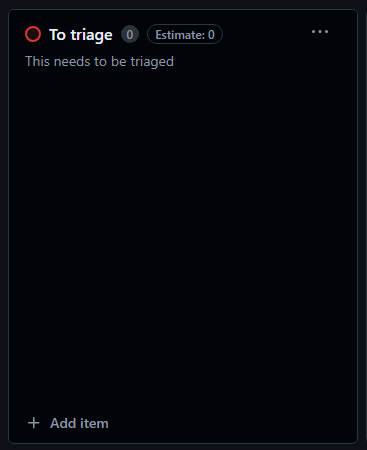
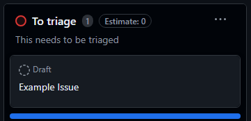
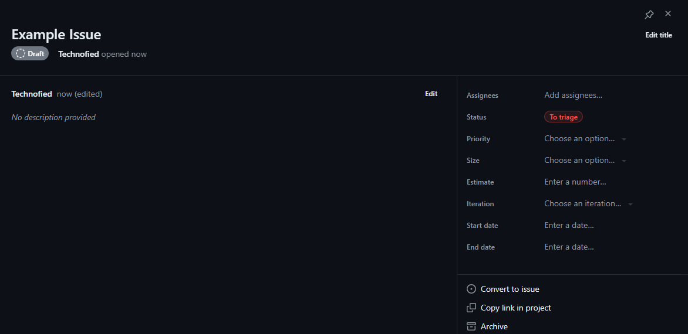
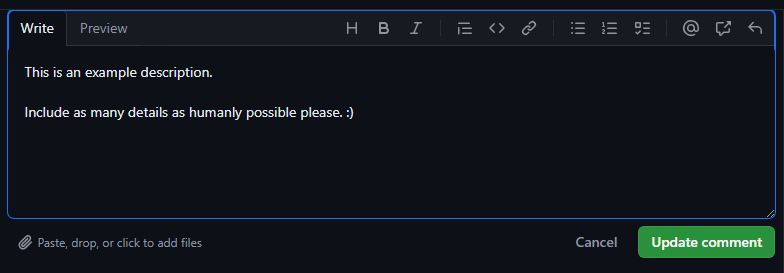
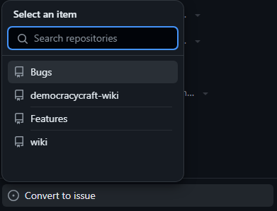
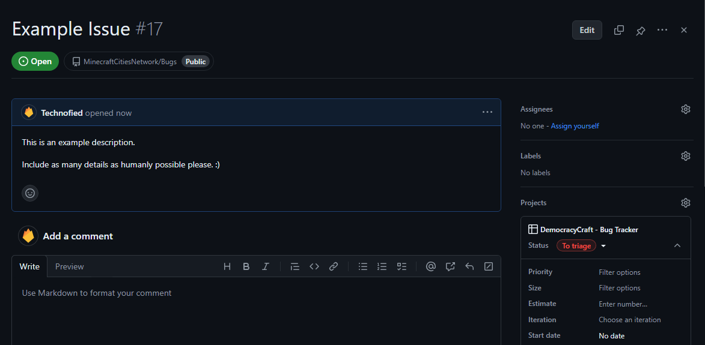
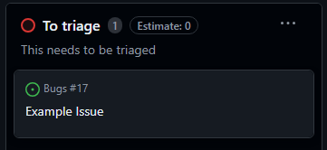

# Bug Tracker
As a Staff member and regular player, you will come across bugs and other technical issues that need solving. DemocracyCraft uses Github Projects to effectively track and manage our bugs.

Make sure you've submitted your Github username in your Staff channel if you haven't already! Register for a free account [here](https://github.com), don't worry - no coding is involved for this...

## How to File an Issue

1. Open our [Github Projects](https://github.com/users/MinecraftCitiesNetwork/projects/2) board.
2. Navigate to the ``To Triage`` column, and click ``+Add Item``.

*Figure 1.0: Opening the board and navigating to the ``To Triage`` column.*

*Figure 1.1: Clicking the ``+Add Item`` button.*
3. Enter a concise title describing your issue in the box provided.

*Figure 1.2: Adding your issue's title.*
4. You will now see your issue filed in the ``To Triage`` column, open it and add a description by clicking the ``Edit`` button **under** the title.

*Figure 1.3: Example issue created under ``To Triage`` column.*

*Figure 1.4: Editor window for issue, where you will edit the description of the issue.*

*Figure 1.5: Adding a description to the example issue.*
5. In the same editor menu, on the right hand side you will see ``Convert to an Issue``. This is the last step you'll need to complete. Click on it, then select **Bugs**.

*Figure 1.6: Example issue, actually converted to be an issue!*

*Figure 1.7 & Figure 1.8: This is what the issue will look like once converted, and it's new appearance in the ``To Triage`` column.*

## All done!
Hooray!