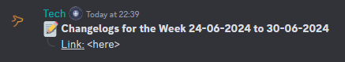
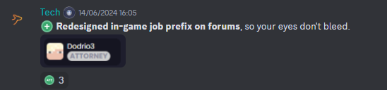
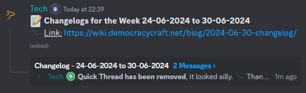

# Managing #changelog
The changelog channel on our main [Discord server](https://discord.gg/democracy) is an important platform for us as Staff to communicate changes to the server to our players. This guide serves as formalised policy on how to post your changes in the channel, as well as prepare a periodic blog post.

## End of Period
Currently, we publish blog posts: Weekly

## Discord 

### Every Monday
At the beginning of each Monday in ``UTC`` timezone, you need to send an opening message in #changelog for the week. The format for the message is:

```
:pencil: **Changelogs for the Week DD-MM-YYYY to DD-MM-YYYY**
:dropdown: __Link:__ 
```



*Figure 1.1 Example completed message for beginning of the week.*

Once you have sent the message, **right click** the message and click ``"Create Thread"``. The title for the thread should be formatted like so: ``Changelog - DD-MM-YYYY to DD-MM-YYYY``.
- Send a message stating the thread is opened, i.e. ``Opened``.
- Each time you complete a bug fix, feature addition, or in general make a backend change, please comment the change using the following format below in the thread you created:
- ```
:plus: **Important part** of the title
:dropdown: More information.
:dropdown: Use as many of these as you want.
```



*Figure 1.2 Example changelog thread entry.*

### Every Sunday
Close your Discord thread, then edit your message to have a link to the blog post you are about to publish. See the next section(s) on how to create your blog post first!



*Figure 1.3 Example completed message for end of the week.*

## Blog Post

### Every Sunday

Create your blog post file by copying and editing the file formatted below.

- File name: ``YYYY-MM-DD-changelog.md``
- File path: ``/blog/``

```
---
slug: YYYY-MM-DD-changelog
title: Changelog as at DD-MM-YYYY
authors: yourname
tags: [changelog, brief, monthhere]
---

# Welcome
This is a brief introduction to this week's changelog. It should not be any longer than 2-3 sentences, it should be upbeat and introductory. Use your own words, there isn't any set format for this.

## Features
- **Important bit** of the change
  - Sub bullet point. 2 max of these.
- **Important bit** of the change
  - Sub bullet point. 2 max of these.


## Government
- **Important bit** of the change
  - Sub bullet point. 2 max of these.
- **Important bit** of the change
  - Sub bullet point. 2 max of these.


## Staff
- None.


# Summary
Another three sentences, keep it brief. You can say whatever you want (within reason).


```

- I used "- None." as an example, of when you have nothing to say.
- You don't need to include images at all, but at a max, have three reasonably sized images.
- **If you are creating a blog post for the first time**, you need to be added as an author to the blog. Ask Technofied or Nacholebraa for this to be done for you!
  - Either one of them will provide you with your name, to replace ``yourname``.

The intent of this post is to be brief and informative! :)

## That's all, folks!
Good job on making it this far...